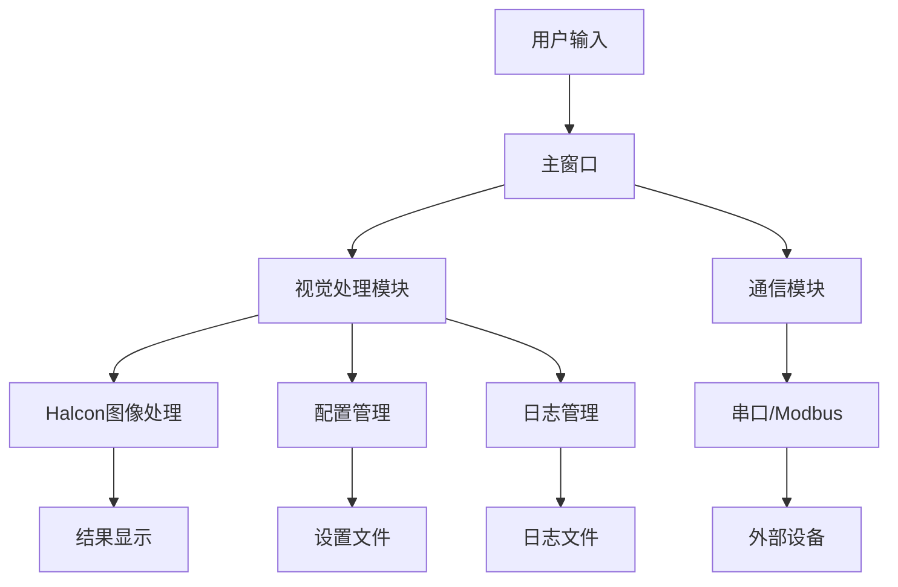

# 📖 MyOperation 系统用户手册 | MyOperation System User Manual

**版本**: 1.0.0  
**创建时间**: 2025年6月5日  
**作者**: jinxi  
**项目类型**: 智能机器视觉系统 | Intelligent Machine Vision System

---

## 📑 目录

1. [系统概述](#系统概述)
2. [系统架构](#系统架构)
3. [主要功能](#主要功能)
4. [安装与配置](#安装与配置)
5. [用户界面介绍](#用户界面介绍)
6. [功能模块详解](#功能模块详解)
7. [操作指南](#操作指南)
8. [故障排除](#故障排除)
9. [最佳实践](#最佳实践)
10. [常见问题](#常见问题)

---

## 🎯 系统概述

MyOperation是一个先进的机器视觉系统，专为工业自动化和质量检测设计。系统集成了Halcon机器视觉库、Qt用户界面框架和多种通信协议，为用户提供完整的视觉处理解决方案。

### 🌟 核心特性

- **🔧 模块化设计**：清晰的模块分离，便于维护和扩展
- **⚡ 高性能处理**：集成Halcon视觉库，支持复杂图像算法
- **🎨 现代化界面**：基于Qt的直观用户界面
- **🔗 灵活通信**：支持串口、Modbus等多种通信协议
- **📊 实时显示**：像素级图像信息实时显示
- **🛠️ 易于扩展**：插件化架构，支持自定义功能模块

### 🏭 应用场景

- **工业质量检测**：产品缺陷检测、尺寸测量
- **自动化生产线**：产品识别、位置定位
- **二维码识别**：条码读取、批量处理
- **机器视觉研发**：算法开发、原型验证

---

## 🏗️ 系统架构

### 📦 核心组件

```
MyOperation/
├── 🎨 用户界面层 (UI Layer)
│   ├── MainWindow          # 主窗口
│   ├── VisualProcess       # 视觉处理界面
│   └── SerialDialog        # 串口通信界面
│
├── 🔧 业务逻辑层 (Business Layer)
│   ├── SettingManager      # 配置管理
│   ├── VisualProcess       # 视觉处理
│   └── Communication       # 通信管理
│
├── 🛠️ 第三方库层 (Third-party Layer)
│   ├── HalconLable         # Halcon集成
│   ├── LogManager          # 日志管理
│   ├── libmodbus           # Modbus通信
│   └── ConfigManager       # 配置管理
│
└── 💾 数据层 (Data Layer)
    ├── 配置文件 (.ini/.json)
    ├── 图像文件
    └── 日志文件
```

### 🔄 数据流程



---

## 🚀 主要功能

### 1. 🔍 机器视觉处理

#### 📷 图像采集与显示
- **多格式支持**：BMP、JPEG、PNG、TIFF等
- **实时预览**：支持相机实时预览
- **缩放操作**：鼠标滚轮缩放、拖拽移动
- **ROI选择**：矩形、圆形、任意形状ROI

#### 🎯 图像处理算法
- **滤波增强**：高斯滤波、均值滤波、锐化
- **边缘检测**：Canny、Sobel、Prewitt算子
- **形态学操作**：膨胀、腐蚀、开运算、闭运算
- **颜色空间**：RGB、HSV、Lab转换

#### 📏 测量功能
- **距离测量**：点到点距离、线段长度
- **角度测量**：两线夹角、圆弧角度
- **面积计算**：区域面积、周长计算
- **几何拟合**：直线拟合、圆形拟合

#### 🔎 识别检测
- **特征匹配**：模板匹配、特征点匹配
- **缺陷检测**：表面瑕疵、尺寸偏差
- **二维码识别**：QR码、Data Matrix
- **OCR文字识别**：字符识别、数字读取

### 2. 📡 通信功能

#### 🔌 串口通信
- **多协议支持**：RS232、RS485
- **参数配置**：波特率、数据位、校验位
- **实时监控**：收发数据监控
- **自动重连**：连接断开自动重连

#### 🌐 网络通信
- **Modbus TCP/RTU**：标准Modbus协议
- **自定义协议**：支持协议扩展
- **设备管理**：多设备连接管理
- **数据缓存**：通信数据缓存机制

### 3. ⚙️ 配置管理

#### 📋 系统配置
- **参数管理**：系统参数统一管理
- **配置备份**：自动备份配置文件
- **版本控制**：配置版本管理
- **导入导出**：配置文件导入导出

#### 🔄 配置同步
- **实时更新**：配置变更实时生效
- **验证机制**：配置有效性验证
- **默认值**：智能默认值设置
- **迁移工具**：配置版本迁移

### 4. 📊 数据管理

#### 📝 日志系统
- **分级记录**：Debug、Info、Warning、Error
- **文件管理**：日志文件自动轮转
- **实时查看**：实时日志显示
- **搜索过滤**：日志内容搜索过滤

#### 💾 数据存储
- **图像存储**：处理结果图像保存
- **报告生成**：检测报告自动生成
- **数据导出**：Excel、CSV格式导出
- **历史查询**：历史数据查询统计

---

## 📦 安装与配置

### 🔧 系统要求

#### 最低配置
- **操作系统**：Windows 10 x64
- **处理器**：Intel i5 或 AMD Ryzen 5
- **内存**：8GB RAM
- **显卡**：支持OpenGL 3.0
- **存储空间**：2GB可用空间

#### 推荐配置
- **操作系统**：Windows 11 x64
- **处理器**：Intel i7 或 AMD Ryzen 7
- **内存**：16GB RAM
- **显卡**：独立显卡，2GB显存
- **存储空间**：10GB可用空间

### 📥 安装步骤

1. **下载安装包**
   ```
   - 从官方网站下载最新版本
   - 验证安装包完整性
   ```

2. **安装程序**
   ```
   - 运行安装程序
   - 选择安装路径
   - 配置环境变量
   ```

3. **许可证配置**
   ```
   - 安装Halcon运行时许可
   - 配置许可证服务器
   - 验证许可证状态
   ```

4. **初始化设置**
   ```
   - 运行系统初始化
   - 配置基本参数
   - 测试系统功能
   ```

### 🔑 许可证管理

#### Halcon许可证
```xml
<!-- 许可证配置示例 -->
<license>
    <type>floating</type>
    <server>192.168.1.100</server>
    <port>1947</port>
    <feature>halcon_progress</feature>
</license>
```

#### 系统激活
1. 获取机器指纹
2. 申请激活码
3. 输入激活信息
4. 验证激活状态

---

## 🖥️ 用户界面介绍

### 🏠 主窗口界面

```
┌─────────────────────────────────────────────────────────────┐
│ 📁 文件  🔧 工具  📡 通信  ⚙️ 设置  ❓ 帮助               │
├─────────────────────────────────────────────────────────────┤
│ 🔄 ⏹️ 📷 💾 🔍 📏 📊                                    │
├─────────────────────────────────────────────────────────────┤
│                                                             │
│            🖼️ 图像显示区域                                  │
│                                                             │
│                                                             │
├─────────────────────────────────────────────────────────────┤
│ 📊 状态栏  |  📡 连接状态  |  ⏰ 处理时间  |  📝 消息       │
└─────────────────────────────────────────────────────────────┘
```

### 🎛️ 工具栏

| 图标 | 功能 | 快捷键 | 说明 |
|------|------|--------|------|
| 📁 | 打开文件 | Ctrl+O | 打开图像文件 |
| 💾 | 保存 | Ctrl+S | 保存当前结果 |
| 🔄 | 刷新 | F5 | 刷新显示内容 |
| 📷 | 采集 | Space | 启动图像采集 |
| 🔍 | 缩放 | Ctrl+鼠标滚轮 | 缩放图像 |
| 📏 | 测量 | M | 启动测量工具 |
| 📊 | 统计 | Ctrl+T | 显示统计信息 |

### 📋 菜单系统

#### 📁 文件菜单
- **新建项目** (Ctrl+N)
- **打开项目** (Ctrl+O)
- **保存项目** (Ctrl+S)
- **另存为** (Ctrl+Shift+S)
- **导入图像** (Ctrl+I)
- **导出结果** (Ctrl+E)
- **最近文件**
- **退出** (Alt+F4)

#### 🔧 工具菜单
- **图像处理**
  - 滤波增强
  - 边缘检测
  - 形态学操作
  - 颜色空间转换
- **测量工具**
  - 距离测量
  - 角度测量
  - 面积计算
- **识别工具**
  - 二维码识别
  - OCR文字识别
  - 模板匹配

#### 📡 通信菜单
- **串口配置**
- **网络配置**
- **设备管理**
- **通信监控**

---

## 🔧 功能模块详解

### 1. 🎨 视觉处理模块 (VisualProcess)

#### 📷 图像操作
```cpp
// 主要功能接口
class VisualProcess {
public:
    // 图像加载
    bool loadImage(const QString& path);
    
    // 图像保存
    bool saveImage(const QString& path);
    
    // 图像处理
    bool processImage(const ProcessParams& params);
    
    // 二维码识别
    QStringList recognizeQRCode();
    
    // 测量功能
    MeasureResult measureDistance(const QPoint& p1, const QPoint& p2);
    MeasureResult measureAngle(const QPoint& center, const QPoint& p1, const QPoint& p2);
};
```

#### 🔧 处理参数
```cpp
struct ProcessParams {
    QString algorithm;      // 算法类型
    QVariantMap parameters; // 算法参数
    QRect roi;             // 处理区域
    bool preprocess;       // 预处理开关
};
```

### 2. 📡 通信模块 (Communication)

#### 🔌 串口通信
```cpp
// 串口配置
struct SerialConfig {
    QString portName;       // 端口名称
    int baudRate;          // 波特率
    int dataBits;          // 数据位
    char parity;           // 校验位
    int stopBits;          // 停止位
};

// 串口操作接口
class SerialManager {
public:
    bool connect(const SerialConfig& config);
    void disconnect();
    bool sendData(const QByteArray& data);
    QByteArray receiveData();
};
```

#### 🌐 Modbus通信
```cpp
// Modbus配置
struct ModbusConfig {
    QString ip;            // IP地址
    int port;              // 端口号
    int slaveId;           // 从站ID
    int timeout;           // 超时时间
};

// Modbus操作接口
class ModbusManager {
public:
    bool connectTCP(const QString& ip, int port);
    bool connectRTU(const QString& device, int baud);
    bool readHoldingRegisters(int address, int count, QVector<quint16>& values);
    bool writeSingleRegister(int address, quint16 value);
};
```

### 3. ⚙️ 配置管理模块 (SettingManager)

#### 📋 配置操作
```cpp
class SettingManager {
public:
    // 基本操作
    void setValue(const QString& key, const QVariant& value);
    QVariant getValue(const QString& key, const QVariant& defaultValue = QVariant());
    
    // 高级功能
    bool backupConfig();
    bool restoreConfig(const QString& backupFile);
    bool validateConfig(const QString& configFile);
    bool migrateConfig(const QString& oldVersion, const QString& newVersion);
};
```

#### 🔄 配置备份
- **自动备份**：系统自动创建配置备份
- **手动备份**：用户手动创建备份点
- **版本管理**：支持多版本配置管理
- **恢复机制**：快速恢复到指定版本

### 4. 📊 日志管理模块 (LogManager)

#### 📝 日志级别
```cpp
enum LogLevel {
    Debug = 0,      // 调试信息
    Info = 1,       // 一般信息
    Warning = 2,    // 警告信息
    Error = 3,      // 错误信息
    Critical = 4    // 严重错误
};
```

#### 📁 日志配置
```ini
[Logging]
level=Info
fileSize=10MB
maxFiles=5
format=%{time} [%{type}] %{file}:%{line} - %{message}
```

---

## 📖 操作指南

### 🚀 快速开始

#### 1. 启动系统
1. 双击桌面图标启动程序
2. 等待系统初始化完成
3. 查看状态栏确认系统就绪

#### 2. 加载图像
1. 点击 📁 打开文件按钮
2. 选择图像文件 (支持BMP, JPEG, PNG, TIFF)
3. 图像将显示在主窗口中央

#### 3. 基本操作
- **缩放**：鼠标滚轮上下滚动
- **平移**：鼠标中键拖拽
- **复位**：双击图像恢复原始大小

### 🔍 图像处理流程

#### 1. 预处理
```
原始图像 → 噪声滤波 → 对比度增强 → 几何校正
```

#### 2. 特征提取
```
预处理图像 → 边缘检测 → 轮廓提取 → 特征计算
```

#### 3. 识别检测
```
特征数据 → 模式匹配 → 结果验证 → 输出结果
```

### 📏 测量操作指南

#### 距离测量
1. 选择测量工具 📏
2. 点击起始点
3. 拖拽到终点
4. 释放鼠标完成测量
5. 查看结果显示

#### 角度测量
1. 选择角度测量工具
2. 点击角度顶点
3. 点击第一条边上的点
4. 点击第二条边上的点
5. 系统自动计算角度

#### 面积测量
1. 选择区域工具
2. 绘制感兴趣区域
3. 双击完成区域选择
4. 系统自动计算面积和周长

### 📡 通信配置指南

#### 串口配置
1. 打开 📡 通信菜单
2. 选择 "串口配置"
3. 设置端口参数：
   ```
   端口：COM1
   波特率：9600
   数据位：8
   校验位：无
   停止位：1
   ```
4. 点击 "连接" 建立通信

#### Modbus配置
1. 选择 "网络配置"
2. 配置Modbus参数：
   ```
   协议：TCP
   IP地址：192.168.1.100
   端口：502
   从站ID：1
   ```
3. 测试连接确认通信正常

### ⚙️ 系统配置

#### 基本设置
1. 打开 ⚙️ 设置菜单
2. 选择 "系统设置"
3. 配置基本参数：
   - 语言选择
   - 主题设置
   - 自动保存间隔
   - 日志级别

#### 高级设置
1. 算法参数调整
2. 性能优化选项
3. 插件管理
4. 许可证管理

---

## 🛠️ 故障排除

### 🚨 常见问题

#### 1. 程序启动失败
**症状**：双击图标无反应或报错

**可能原因**：
- 缺少必要的运行库
- 许可证过期或无效
- 系统权限不足

**解决方案**：
```bash
# 检查运行库
1. 安装 Visual C++ Redistributable
2. 安装 .NET Framework 4.8
3. 更新显卡驱动

# 检查许可证
1. 运行许可证管理器
2. 验证许可证状态
3. 联系技术支持
```

#### 2. 图像加载失败
**症状**：无法打开图像文件

**可能原因**：
- 文件格式不支持
- 文件损坏
- 路径包含特殊字符

**解决方案**：
- 转换为支持的格式 (BMP, JPEG, PNG, TIFF)
- 检查文件完整性
- 使用英文路径

#### 3. 处理速度慢
**症状**：图像处理耗时过长

**优化建议**：
```cpp
// 性能优化设置
- 降低图像分辨率
- 优化ROI区域
- 调整算法参数
- 启用GPU加速
```

#### 4. 通信连接失败
**症状**：无法连接外部设备

**排查步骤**：
1. **物理连接检查**
   - 检查线缆连接
   - 确认设备电源
   - 验证端口状态

2. **软件配置检查**
   - 验证通信参数
   - 检查设备驱动
   - 测试端口占用

3. **网络问题排查**
   ```bash
   # 网络连通性测试
   ping 192.168.1.100
   telnet 192.168.1.100 502
   ```

### 🔧 诊断工具

#### 系统诊断
```cpp
// 内置诊断命令
SystemDiagnostic::checkHardware();      // 硬件检查
SystemDiagnostic::checkSoftware();      // 软件检查
SystemDiagnostic::checkLicense();       // 许可证检查
SystemDiagnostic::checkNetwork();       // 网络检查
```

#### 日志分析
```bash
# 日志文件位置
Windows: C:\ProgramData\MyOperation\logs\
Linux: /var/log/myoperation/

# 关键日志文件
- application.log    # 应用程序日志
- communication.log  # 通信日志
- processing.log     # 处理过程日志
- error.log         # 错误日志
```

---

## 💡 最佳实践

### 🎯 性能优化

#### 1. 图像处理优化
```cpp
// 推荐做法
- 预处理阶段降低分辨率
- 使用合适的ROI区域
- 避免重复计算
- 利用缓存机制

// 示例代码
HObject resizedImage;
ReduceDomain(image, roi, reducedImage);
ZoomImageFactor(reducedImage, resizedImage, 0.5, 0.5, "constant");
```

#### 2. 内存管理
```cpp
// 及时释放资源
HObject image, result;
// ... 处理代码 ...
image.Clear();
result.Clear();

// 使用智能指针
std::unique_ptr<HalconLable> halconWidget(new HalconLable);
```

#### 3. 多线程处理
```cpp
// 避免UI线程阻塞
QFuture<ProcessResult> future = QtConcurrent::run([=]() {
    return processImage(image, parameters);
});

// 监控处理进度
QFutureWatcher<ProcessResult> watcher;
connect(&watcher, &QFutureWatcher<ProcessResult>::finished,
        this, &MainWindow::onProcessFinished);
watcher.setFuture(future);
```

### 🔒 安全考虑

#### 1. 数据保护
- 定期备份配置文件
- 加密敏感参数
- 访问权限控制
- 审计日志记录

#### 2. 系统稳定性
- 异常处理机制
- 自动恢复功能
- 资源泄漏检测
- 看门狗监控

### 📊 维护建议

#### 1. 定期维护
```bash
# 每周维护任务
- 清理临时文件
- 检查磁盘空间
- 更新病毒库
- 验证备份完整性

# 每月维护任务
- 系统性能评估
- 日志文件归档
- 软件版本检查
- 硬件状态检查
```

#### 2. 监控指标
- **CPU使用率**：< 80%
- **内存使用率**：< 85%
- **磁盘使用率**：< 90%
- **网络延迟**：< 100ms

---

## ❓ 常见问题

### 🔧 安装配置类

**Q1: 安装时提示缺少依赖库怎么办？**

A1: 安装必要的运行库：
```bash
1. Microsoft Visual C++ Redistributable (最新版本)
2. .NET Framework 4.8 或更高版本
3. DirectX 9.0c 或更高版本
```

**Q2: 如何配置Halcon许可证？**

A2: 许可证配置步骤：
```
1. 启动Halcon许可证管理器
2. 输入许可证文件路径或服务器信息
3. 验证许可证状态
4. 重启应用程序
```

### 🖼️ 图像处理类

**Q3: 支持哪些图像格式？**

A3: 支持的图像格式：
- **输入格式**：BMP, JPEG, PNG, TIFF, TGA, PGM, PPM
- **输出格式**：BMP, JPEG, PNG, TIFF
- **特殊格式**：Halcon原生格式 (.hobj)

**Q4: 如何提高处理速度？**

A4: 性能优化建议：
```cpp
1. 缩小图像尺寸或ROI区域
2. 选择合适的算法参数
3. 启用GPU加速（如果支持）
4. 使用多线程处理
5. 优化内存使用
```

### 📡 通信问题类

**Q5: 串口通信连接失败？**

A5: 排查步骤：
```
1. 检查串口是否被其他程序占用
2. 验证串口参数设置
3. 确认硬件连接正常
4. 检查驱动程序是否正确安装
```

**Q6: Modbus通信超时？**

A6: 解决方法：
```cpp
1. 增加超时时间设置
2. 检查网络连接稳定性
3. 验证设备地址配置
4. 确认防火墙设置
```

### ⚙️ 系统配置类

**Q7: 如何备份和恢复配置？**

A7: 配置管理：
```cpp
// 备份配置
SettingManager::backupConfig();

// 恢复配置
SettingManager::restoreConfig("backup_20250605.ini");

// 配置文件位置
Windows: %APPDATA%\MyOperation\config\
Linux: ~/.config/MyOperation/
```

**Q8: 如何重置为默认设置？**

A8: 重置步骤：
```
1. 关闭应用程序
2. 删除配置文件目录
3. 重新启动程序
4. 系统将自动创建默认配置
```

### 📊 数据管理类

**Q9: 日志文件太大怎么办？**

A9: 日志管理：
```ini
# 配置日志轮转
[Logging]
maxFileSize=10MB
maxFiles=5
autoClean=true
cleanInterval=7  # 7天清理一次
```

**Q10: 如何导出处理结果？**

A10: 结果导出：
```cpp
1. 图像结果：支持多种图像格式
2. 数据结果：Excel, CSV, JSON格式
3. 报告生成：PDF格式报告
4. 批量导出：支持批量操作
```

---

## 📞 技术支持

### 🏢 联系方式
- **技术支持邮箱**：support@myoperation.com
- **官方网站**：https://www.myoperation.com
- **用户论坛**：https://forum.myoperation.com
- **GitHub项目**：https://github.com/myoperation/myoperation

### 📋 支持信息
- **支持时间**：工作日 9:00-18:00
- **响应时间**：24小时内响应
- **技术文档**：https://docs.myoperation.com
- **视频教程**：https://video.myoperation.com

### 🔄 版本更新
- **更新检查**：程序自动检查更新
- **发布周期**：每3个月发布新版本
- **更新日志**：详见 CHANGELOG.md
- **beta测试**：提前体验新功能

---

**📄 文档版本**: 1.0.0  
**📅 最后更新**: 2025年6月5日  
**👤 文档维护**: jinxi  
**📧 反馈邮箱**: jinxi@myoperation.com

---

*本手册为MyOperation智能机器视觉系统的官方用户手册，如有疑问请联系技术支持团队。*
