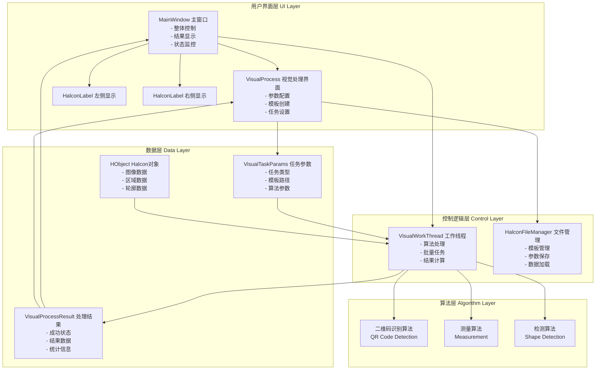
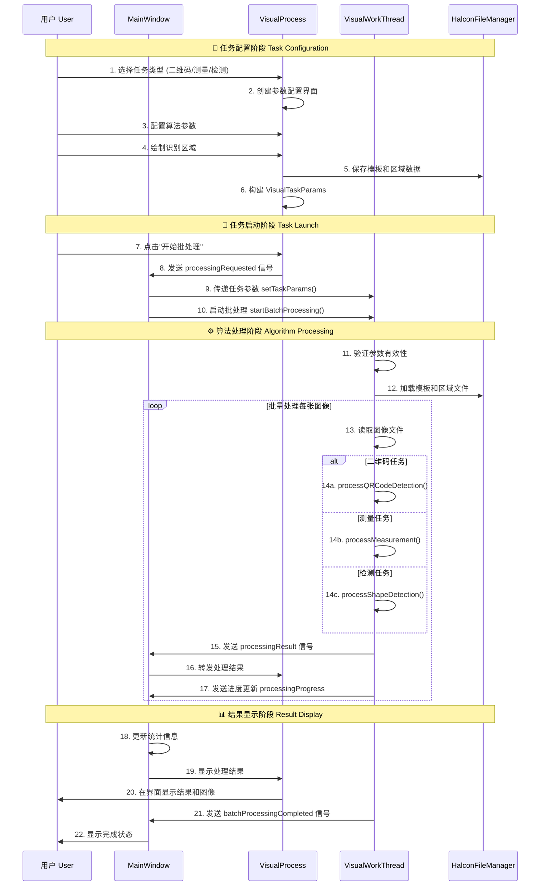
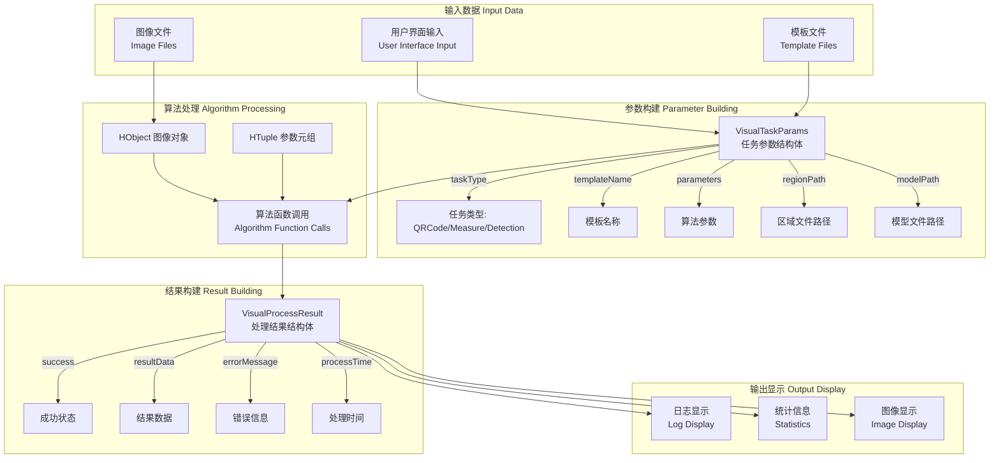

我来帮您分析这个项目的开发流程和数据交互。首先让我仔细阅读项目的关键文件来理解架构。

Read file: inc/mainwindow.h

Read file: inc/visualprocess.h

Read file: inc/visualWorkThread.h

Read file: docs/Visual_Processing_Workflow_Guide.md
现在让我分析项目的数据交互和开发流程，并生成相应的mermaid图表。

根据我对代码的分析，这是一个基于Qt和Halcon的视觉处理系统。作为一位有30年开发经验的导师，我来为您详细解析这个项目的架构和开发流程。

## 🏗️ 项目整体架构分析

这个项目采用了**MVC + 多线程**的设计模式，具有以下特点：

1. **模块化设计**：将界面、控制逻辑和算法处理分离
2. **多线程架构**：避免界面冻结，提升用户体验  
3. **信号槽机制**：实现松耦合的模块间通信
4. **统一的数据结构**：使用结构体规范数据传递

## 📊 系统架构图

## 🔄 数据交互流程图

## 🗂️ 核心数据结构流转图

## 💡 开发流程和最佳实践

### 🎯 为什么要这样设计？

1. **分层架构的优势**：
   - **界面与逻辑分离**：便于维护和扩展
   - **多线程处理**：保证界面响应性
   - **模块化设计**：方便团队开发和测试

2. **信号槽机制的好处**：
   - **松耦合**：模块间依赖性低
   - **异步通信**：支持多线程安全
   - **扩展性强**：容易添加新功能

### 🛠️ 开发建议

作为新手开发者，建议您：

1. **从简单开始**：先理解单个模块的功能
2. **逐步深入**：理解模块间的交互关系  
3. **实践为主**：通过调试理解数据流向
4. **文档先行**：始终保持代码文档的更新

### 📝 学习重点

1. **Qt信号槽机制**：这是Qt框架的核心
2. **多线程编程**：避免界面冻结的关键
3. **设计模式**：MVC模式在实际项目中的应用
4. **Halcon集成**：图像处理算法的封装方法

这个项目是一个很好的学习案例，它展示了如何将复杂的视觉算法集成到用户友好的桌面应用程序中。通过分析这个项目，您可以学到现代软件开发的最佳实践。
