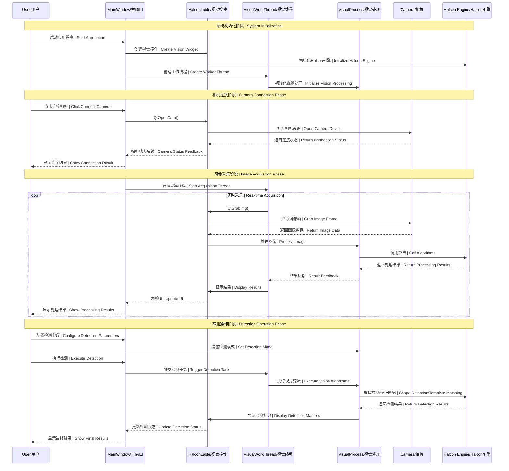
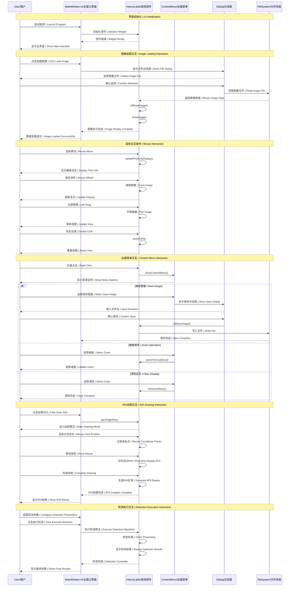
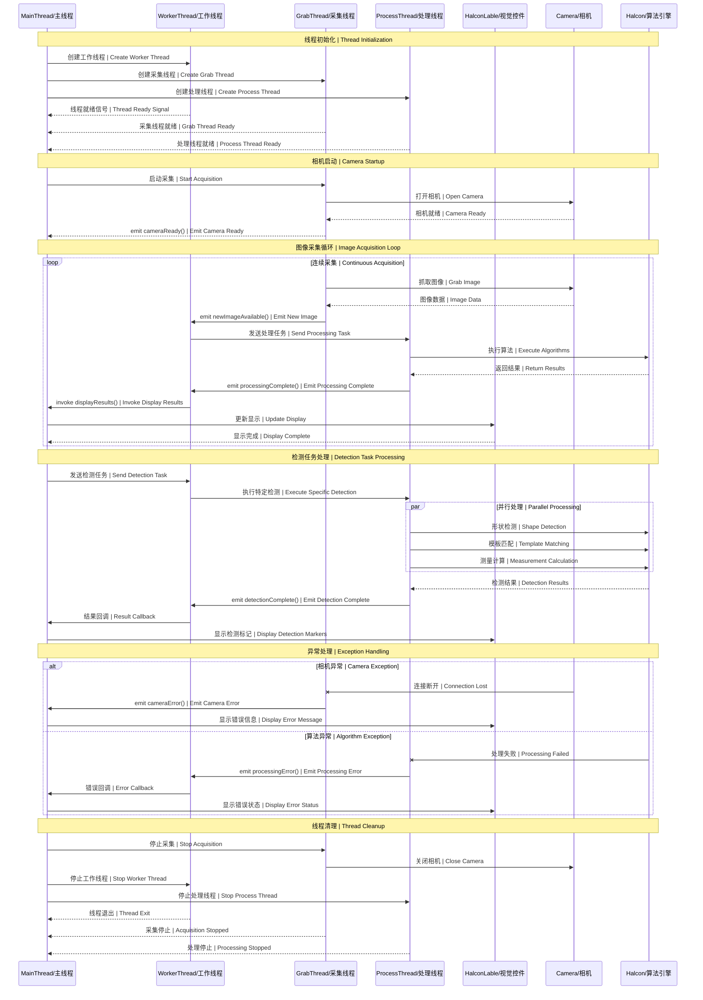
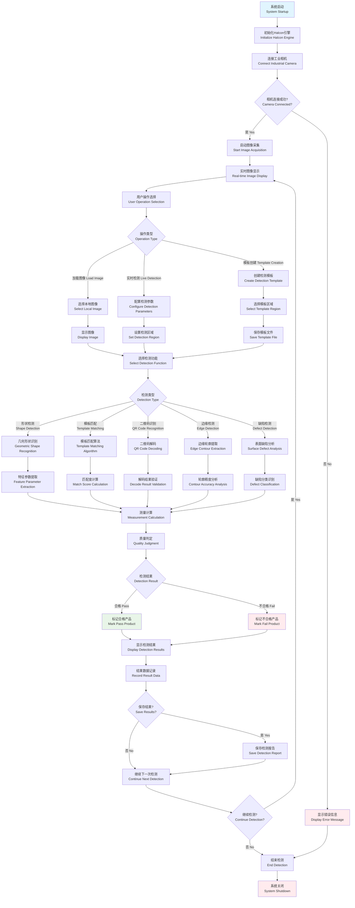
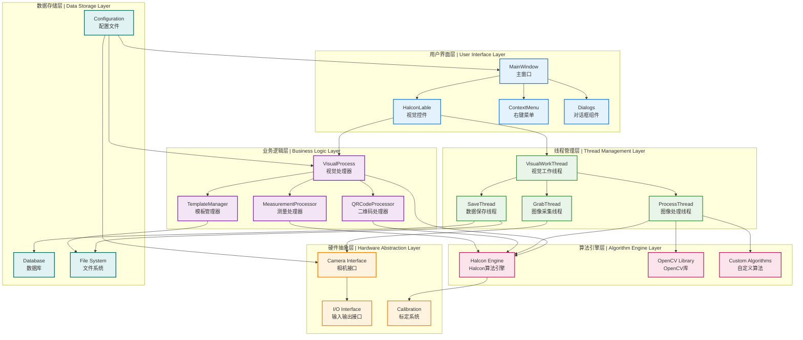

# 🏗️ HalconLable 架构图表集合 | Architecture Diagrams Collection

<div align="center">


### 🎯 基于 HalconLable 的机器视觉系统架构分析

**时序图 • 流程图 • 交互图 | Sequence • Flow • Interaction Diagrams**

</div>

---

## 📋 目录 | Table of Contents

- [🔄 系统组件时序图](#-系统组件时序图--system-component-sequence)
- [📷 图像处理流程图](#-图像处理流程图--image-processing-flowchart)
- [🎮 用户交互时序图](#-用户交互时序图--user-interaction-sequence)
- [🧵 多线程协作时序图](#-多线程协作时序图--multi-thread-collaboration)
- [📊 视觉检测完整流程](#-视觉检测完整流程--complete-vision-detection-flow)
- [🔧 系统架构概览](#-系统架构概览--system-architecture-overview)

---

## 🔄 系统组件时序图 | System Component Sequence

### 🏗️ 主要组件交互时序



---

## 📷 图像处理流程图 | Image Processing Flowchart

### 🔄 完整图像处理流程

```mermaid
flowchart TD
    Start([开始 | Start]) --> InitCamera{初始化相机<br/>Initialize Camera}
    
    InitCamera -->|成功 Success| CameraReady[相机就绪<br/>Camera Ready]
    InitCamera -->|失败 Failed| ErrorHandle[错误处理<br/>Error Handling]
    
    CameraReady --> GrabImage[抓取图像<br/>Grab Image]
    
    GrabImage --> ImageValid{图像有效?<br/>Image Valid?}
    ImageValid -->|无效 Invalid| GrabImage
    ImageValid -->|有效 Valid| PreProcess[图像预处理<br/>Image Preprocessing]
    
    PreProcess --> FilterNoise[噪声滤波<br/>Noise Filtering]
    FilterNoise --> EnhanceContrast[对比度增强<br/>Contrast Enhancement]
    EnhanceContrast --> EdgeDetection[边缘检测<br/>Edge Detection]
    
    EdgeDetection --> ROISelection{ROI选择<br/>ROI Selection}
    ROISelection -->|手动 Manual| DrawROI[绘制ROI<br/>Draw ROI]
    ROISelection -->|自动 Auto| AutoROI[自动ROI<br/>Auto ROI]
    
    DrawROI --> ProcessROI[处理ROI区域<br/>Process ROI]
    AutoROI --> ProcessROI
    
    ProcessROI --> DetectionType{检测类型<br/>Detection Type}
    
    DetectionType -->|形状检测 Shape| ShapeDetection[形状检测算法<br/>Shape Detection Algorithm]
    DetectionType -->|模板匹配 Template| TemplateMatching[模板匹配算法<br/>Template Matching Algorithm]
    DetectionType -->|二维码 QR Code| QRDetection[二维码识别<br/>QR Code Recognition]
    DetectionType -->|3D检测 3D| 3DDetection[3D检测算法<br/>3D Detection Algorithm]
    
    ShapeDetection --> ExtractFeatures[特征提取<br/>Feature Extraction]
    TemplateMatching --> MatchScore[匹配评分<br/>Match Scoring]
    QRDetection --> DecodeQR[解码内容<br/>Decode Content]
    3DDetection --> PointCloud[点云处理<br/>Point Cloud Processing]
    
    ExtractFeatures --> Measurement[测量计算<br/>Measurement Calculation]
    MatchScore --> Measurement
    DecodeQR --> Measurement
    PointCloud --> Measurement
    
    Measurement --> QualityCheck{质量检查<br/>Quality Check}
    QualityCheck -->|合格 Pass| ResultPass[检测通过<br/>Detection Pass]
    QualityCheck -->|不合格 Fail| ResultFail[检测失败<br/>Detection Fail]
    
    ResultPass --> DisplayResult[显示结果<br/>Display Results]
    ResultFail --> DisplayResult
    
    DisplayResult --> SaveData{保存数据?<br/>Save Data?}
    SaveData -->|是 Yes| SaveResults[保存检测结果<br/>Save Detection Results]
    SaveData -->|否 No| ContinueLoop[继续循环<br/>Continue Loop]
    
    SaveResults --> ContinueLoop
    ContinueLoop --> GrabImage
    
    ErrorHandle --> End([结束 | End])
    
    style Start fill:#e1f5fe
    style End fill:#ffebee
    style ResultPass fill:#e8f5e8
    style ResultFail fill:#ffebee
    style ErrorHandle fill:#ffebee
```

---

## 🎮 用户交互时序图 | User Interaction Sequence

### 🖱️ 用户操作交互流程



---

## 🧵 多线程协作时序图 | Multi-Thread Collaboration

### 🔄 线程间协作机制



---

## 📊 视觉检测完整流程 | Complete Vision Detection Flow

### 🔍 端到端检测流程



---

## 🔧 系统架构概览 | System Architecture Overview

### 🏗️ 整体架构组件关系



---

## 📋 图表使用说明 | Diagram Usage Guide

### 🎯 如何阅读这些图表 | How to Read These Diagrams

#### 1. **时序图 (Sequence Diagrams)**
- **箭头方向**: 消息流向和调用关系
- **生命线**: 对象的存在时间
- **激活框**: 对象处于活跃状态的时间
- **注释框**: 不同阶段的说明

#### 2. **流程图 (Flowcharts)**
- **矩形**: 处理步骤
- **菱形**: 判断节点
- **圆角矩形**: 开始/结束节点
- **箭头**: 流程方向

#### 3. **架构图 (Architecture Diagrams)**
- **子图**: 不同的系统层次
- **节点**: 系统组件
- **连线**: 组件间的依赖关系
- **颜色**: 不同层次的区分

### 📝 图表应用场景 | Diagram Application Scenarios

| 图表类型 | 适用场景 | 目标用户 |
|---------|---------|---------|
| **系统组件时序图** | 理解组件交互顺序 | 架构师，高级开发者 |
| **图像处理流程图** | 了解算法处理流程 | 算法工程师，测试工程师 |
| **用户交互时序图** | 设计用户体验流程 | UI设计师，产品经理 |
| **多线程协作时序图** | 解决并发编程问题 | 系统开发者，性能优化工程师 |
| **视觉检测完整流程** | 理解业务处理逻辑 | 业务分析师，项目经理 |
| **系统架构概览** | 系统整体架构设计 | 技术总监，架构师 |

---

<div align="center">

## 🎉 架构图表使用建议 | Architecture Diagram Usage Recommendations

### 💡 开发流程建议 | Development Process Recommendations

**📋 需求分析阶段**: 参考"视觉检测完整流程"理解业务需求  
**🏗️ 架构设计阶段**: 参考"系统架构概览"进行模块划分  
**🧵 并发设计阶段**: 参考"多线程协作时序图"设计线程策略  
**🎮 界面设计阶段**: 参考"用户交互时序图"优化用户体验  
**🔧 开发实现阶段**: 参考"系统组件时序图"理解调用关系  
**🧪 测试验证阶段**: 参考"图像处理流程图"设计测试用例

### 🔗 相关文档链接 | Related Documentation Links

- [📘 HalconLable API Manual](HalconLable_API_Manual.md)
- [⚡ 快速参考卡片](HalconLable_Quick_Reference.md)
- [📖 完整使用手册](HalconLable使用手册.md)
- [📚 文档中心](README.md)

---

**📊 这些图表帮助您深入理解 HalconLable 系统的架构设计和工作原理**  
**These diagrams help you understand the architecture design and working principles of HalconLable system**

**文档版本：v1.0** | **更新日期：2025-05-31** | **维护者：开发团队**

</div> 