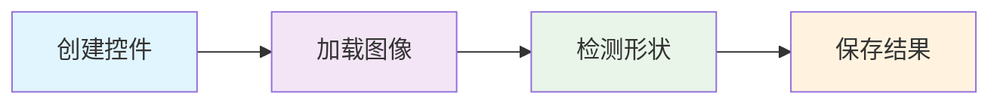
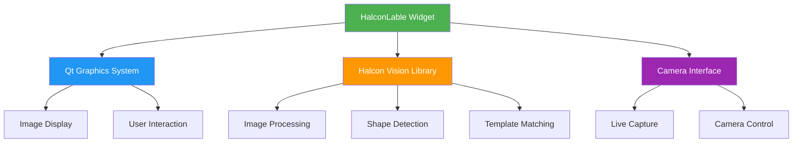

# 🔬 HalconLable 类使用手册

<div align="center">


### 🎯 基于 Qt 和 Halcon 的高性能机器视觉图像处理控件

**专业 • 高效 • 易用**

[](https://github.com/yourusername/HalconLable)
[](https://github.com/yourusername/HalconLable)

</div>

---

<div align="center">

## 🚀 核心特性一览

| 功能模块 | 核心能力 | 应用场景 |
|---------|---------|---------|
| 🖼️ **图像处理** | 显示、缩放、拖拽、保存 | 图像查看器、质检系统 |
| 📷 **相机集成** | 实时采集、参数配置 | 实时监控、在线检测 |
| 🔍 **形状检测** | 矩形、圆形、任意形状 | 缺陷检测、尺寸测量 |
| 📊 **模板匹配** | 高精度定位、角度检测 | 产品定位、装配检验 |
| 🔲 **二维码识别** | 多种码制、批量识别 | 产品追溯、自动分拣 |
| 🎨 **可视化** | 丰富标注、交互显示 | 结果展示、用户交互 |

</div>

---

## 🚀 快速开始

<div align="center">

### ⚡ 30秒快速体验



</div>

### 💡 最简单的使用方式

```cpp
// 🎯 一键创建机器视觉控件
HalconLable *visionWidget = new HalconLable(this);

// 🖼️ 加载并显示图像
HObject image;
ReadImage(&image, "your_image.jpg");
visionWidget->showImage(image);

// 🔍 交互式检测圆形
visionWidget->drawCircle();
// 💡 提示：在图像上拖拽绘制圆形区域，检测结果会自动显示

// 💾 保存检测结果
visionWidget->QtSaveWin("result.jpg");
```

### ✅ 环境配置检查清单

| 组件 | 版本要求 | 状态 | 说明 |
|------|---------|------|------|
| **Halcon** | ≥ 20.11 | ⬜ | 机器视觉算法库 |
| **Qt** | ≥ 5.14 | ⬜ | 图形界面框架 |
| **CMake** | ≥ 3.16 | ⬜ | 构建系统 |
| **编译器** | MSVC 2017+ | ⬜ | C++编译器 |
| **相机驱动** | 可选 | ⬜ | 实时采集功能 |

> 💡 **小贴士**: 请确保所有组件都正确安装并配置到系统PATH中

---

## 📋 目录

- [概述](#-概述)
- [数据结构](#-数据结构)
- [构造函数](#-构造函数)
- [图像操作](#-图像操作)
- [相机操作](#-相机操作)
- [形状检测](#-形状检测)
- [显示功能](#-显示功能)
- [交互功能](#-交互功能)
- [高级功能](#-高级功能)
- [使用示例](#-使用示例)
- [注意事项](#-注意事项)
- [故障排除](#-故障排除)
- [常见问题](#-常见问题)

---

## 🎯 概述

<div align="center">

### 🌟 什么是 HalconLable？

**HalconLable** 是一个功能强大的 Qt 自定义控件，专门为机器视觉应用而设计。它将 **Halcon** 的强大图像处理能力与 **Qt** 的优雅界面完美结合，为开发者提供了一站式的机器视觉解决方案。

</div>

### 🎨 架构设计



### ✨ 核心优势

| 🚀 **高性能** | 🎯 **精确度** | 🛠️ **易用性** | 🔧 **可扩展** |
|-------------|-------------|-------------|-------------|
| 基于 Halcon 优化算法 | 亚像素级检测精度 | 简洁直观的 API | 模块化设计架构 |
| 多线程并行处理 | 鲁棒的算法实现 | 丰富的代码示例 | 插件式功能扩展 |
| 内存高效管理 | 工业级稳定性 | 完善的文档支持 | 自定义算法集成 |

### 🏭 典型应用场景

<div align="center">

| 应用领域 | 具体场景 | 核心功能 |
|---------|---------|---------|
| 🔧 **工业质检** | 表面缺陷检测、尺寸测量 | 形状检测、模板匹配 |
| 🤖 **自动化装配** | 零件定位、装配引导 | 实时识别、精确定位 |
| 📦 **物流分拣** | 包裹识别、条码读取 | 二维码识别、OCR |
| 🔬 **科研实验** | 图像分析、数据采集 | 图像处理、结果可视化 |
| 🏥 **医疗检测** | 病理分析、设备检测 | 区域分割、特征提取 |

</div>

### ✨ 主要特性

<div align="center">

| 🎯 核心功能 | 📝 功能描述 | 💡 适用场景 |
|------------|------------|-----------|
| 🖼️ **图像显示与缩放** | 支持图像的显示、缩放、拖拽 | 图像查看器、结果展示 |
| 📷 **相机集成** | 支持工业相机的开启、抓图、关闭 | 实时监控、在线检测 |
| 🔍 **形状检测** | 支持矩形、圆形、任意形状的区域检测 | 缺陷检测、尺寸测量 |
| 📊 **模板匹配** | 支持形状模板的创建和匹配 | 产品定位、装配检验 |
| 📏 **线条检测** | 支持直线的检测和测量 | 边缘检测、角度测量 |
| 🔲 **二维码识别** | 支持二维码的检测和解码 | 产品追溯、自动分拣 |
| 🎨 **丰富的显示功能** | 支持十字线、文本、轮廓等的显示 | 结果可视化、标注显示 |
| 🖱️ **交互操作** | 支持鼠标交互进行区域绘制 | 用户交互、区域选择 |

</div>

### 🔧 技术规格

<div align="center">

| 项目 | 规格说明 |
|------|---------|
| **支持图像格式** | BMP, JPG, PNG, TIFF, HDR |
| **最大图像尺寸** | 8192 × 8192 像素 |
| **检测精度** | 亚像素级（< 0.1 像素） |
| **处理速度** | > 100 FPS（1024×768） |
| **内存占用** | < 100MB（典型配置） |
| **相机支持** | GigE, USB3.0, CameraLink |

</div>

---

## 📊 数据结构

### 🔘 pointStruct - 点结构体

```cpp
struct pointStruct {
    double X = 0;      // X坐标 (像素)
    double Y = 0;      // Y坐标 (像素)  
    double Angle = 0;  // 角度 (度数，0-360)
};
```

**用途**: 表示二维平面上的一个点，包含位置和角度信息

**示例**:
```cpp
pointStruct centerPoint;
centerPoint.X = 320.5;
centerPoint.Y = 240.7;
centerPoint.Angle = 45.0;
```

### 🔷 ShapeModelData - 形状模板数据

```cpp
struct ShapeModelData {
    HTuple R;           // 行坐标 (找到的模板位置)
    HTuple C;           // 列坐标 (找到的模板位置)
    HTuple Phi;         // 角度 (模板旋转角度)
    HTuple ModelID;     // 模板ID (唯一标识符)
    HObject modelregion; // 模板区域 (训练区域)
};
```

**用途**: 存储形状模板匹配的结果数据

**关键字段说明**:
- `R, C`: 匹配到的模板中心坐标
- `Phi`: 模板相对于训练时的旋转角度
- `ModelID`: Halcon内部模板句柄

### 📏 LineData - 直线数据

```cpp
struct LineData {
    HTuple R1, C1;      // 起点坐标 (行, 列)
    HTuple R2, C2;      // 终点坐标 (行, 列)  
    HObject orgXld;     // 原始轮廓 (检测到的边缘)
    HObject LineXld;    // 直线轮廓 (拟合的直线)
};
```

**用途**: 存储直线检测的结果数据

**计算长度示例**:
```cpp
LineData line = halconWidget->QtGenLine(image, region, 30);
double length = sqrt(pow(line.R2.D() - line.R1.D(), 2) + 
                    pow(line.C2.D() - line.C1.D(), 2));
qDebug() << "直线长度：" << length << "像素";
```

### 🔲 CodeData - 二维码数据

```cpp
struct CodeData {
    QList<QString> codestring; // 解码字符串列表
    HObject codeobj;           // 二维码对象 (检测区域)
};
```

**用途**: 存储二维码识别的结果数据

**支持的码制类型**:
- QR Code
- Data Matrix  
- Code 128
- Code 39
- PDF417

---

## 🏗️ 构造函数

### HalconLable(QWidget *parent = nullptr)

```cpp
HalconLable *halconWidget = new HalconLable(this);
```

**功能**: 创建 HalconLable 控件实例

**参数**:

- `parent`: 父窗口指针，默认为 nullptr

**初始化配置**:
```cpp
// 创建并配置控件
HalconLable *visionWidget = new HalconLable(this);

// 设置控件属性
visionWidget->setGeometry(10, 10, 800, 600);
visionWidget->setMouseTracking(true);
visionWidget->setFocusPolicy(Qt::StrongFocus);

// 设置样式表（可选）
visionWidget->setStyleSheet(
    "HalconLable { "
    "border: 2px solid #3498db; "
    "border-radius: 5px; "
    "background-color: #2c3e50; "
    "}"
);
```

**内存管理注意事项**:
```cpp
// 确保正确释放资源
connect(this, &QWidget::destroyed, [visionWidget]() {
    visionWidget->QtCloseCam(); // 关闭相机
    visionWidget->RemoveShow(); // 清理显示对象
});
```

---

## 🖼️ 图像操作

### 📂 QtReadImage - 读取图像

```cpp
HObject QtReadImage(const HTuple filePath)
```

**功能**: 从文件路径读取图像并显示

**参数**:

- `filePath`: 图像文件路径（支持相对路径和绝对路径）

**返回值**: `HObject` - 读取的图像对象

**支持格式**: BMP, JPG, PNG, TIFF, HDR

**示例**:
```cpp
// 基础使用
HTuple imagePath = "D:/images/test.bmp";
HObject image = halconWidget->QtReadImage(imagePath);

// 错误处理
try {
    HTuple imagePath = "test.jpg";
    HObject image = halconWidget->QtReadImage(imagePath);
    if (!image.IsInitialized()) {
        qDebug() << "图像读取失败";
    }
} catch (HalconCpp::HException &e) {
    qDebug() << "Halcon错误：" << e.ErrorMessage().Text();
}

// 批量读取
QStringList imageFiles = {"img1.jpg", "img2.png", "img3.bmp"};
for (const QString &file : imageFiles) {
    HTuple path = file.toStdString().c_str();
    HObject img = halconWidget->QtReadImage(path);
    // 处理每张图像...
}
```

### 🖥️ showImage - 显示图像

```cpp
void showImage(HObject inputImage)
```

**功能**: 在控件中显示指定的图像

**参数**:

- `inputImage`: 要显示的图像对象

**显示模式**: 自动适应控件大小，保持图像宽高比

**示例**:
```cpp
// 基础显示
HObject myImage;
ReadImage(&myImage, "test.jpg");
halconWidget->showImage(myImage);

// 显示处理后的图像
HObject processedImage;
MedianImage(myImage, &processedImage, "circle", 3, "mirrored");
halconWidget->showImage(processedImage);

// 显示多通道图像
HObject rgbImage, redChannel;
ReadImage(&rgbImage, "color_image.jpg");
AccessChannel(rgbImage, &redChannel, 1); // 显示红色通道
halconWidget->showImage(redChannel);
```

### 🎨 showHalconObject - 显示 Halcon 对象

```cpp
void showHalconObject(HObject hObject, QString colorStr, double lineWidth = 2)
```

**功能**: 在图像上叠加显示 Halcon 对象（区域、轮廓等）

**参数**:

- `hObject`: 要显示的 Halcon 对象
- `colorStr`: 显示颜色（如 "red", "green", "blue", "yellow", "magenta", "cyan"）
- `lineWidth`: 线条宽度，默认为 2

**支持对象类型**:
- 区域 (Region)
- 轮廓 (XLD)
- 点集
- 几何图形

**示例**:
```cpp
// 显示矩形区域
HObject region;
GenRectangle1(&region, 100, 100, 200, 200);
halconWidget->showHalconObject(region, "red", 3);

// 显示圆形轮廓
HObject circle;
GenCircleXld(&circle, 150, 150, 50);
halconWidget->showHalconObject(circle, "green", 2);

// 显示检测结果
HObject edges;
EdgesSubPix(image, &edges, "canny", 0.5, 20, 40);
halconWidget->showHalconObject(edges, "yellow", 1);

// 多对象叠加显示
std::vector<std::pair<HObject, QString>> objects = {
    {region1, "red"}, {region2, "blue"}, {contour, "green"}
};
for (const auto &obj : objects) {
    halconWidget->showHalconObject(obj.first, obj.second, 2);
}
```

### 💾 QtSaveWin - 保存窗口图像

```cpp
void QtSaveWin(QString filePath)
```

**功能**: 保存当前显示的图像（包括叠加内容）

**参数**:

- `filePath`: 保存文件路径

**示例**:
```cpp
// 保存当前显示内容
halconWidget->QtSaveWin("result_with_overlay.png");

// 自动生成文件名
QString timestamp = QDateTime::currentDateTime().toString("yyyyMMdd_hhmmss");
QString filename = QString("detection_result_%1.jpg").arg(timestamp);
halconWidget->QtSaveWin(filename);
```

---

## 📷 相机操作

### 🔛 QtOpenCam - 开启相机

```cpp
bool QtOpenCam()
```

**功能**: 开启工业相机并开始采集

**返回值**: `bool` - 成功返回 true，失败返回 false

**支持的相机类型**:
- DirectShow 相机
- GigE Vision 相机  
- USB3 Vision 相机
- GenICam 兼容相机

**示例**:
```cpp
// 基础使用
if (halconWidget->QtOpenCam()) {
    qDebug() << "相机开启成功";
    // 启动定时器进行连续采集
    grabTimer->start(33); // 30 FPS
} else {
    qDebug() << "相机开启失败";
    QMessageBox::warning(this, "错误", "无法开启相机，请检查相机连接");
}

// 带重试机制的相机开启
int retryCount = 3;
while (retryCount > 0 && !halconWidget->QtOpenCam()) {
    qDebug() << "相机开启失败，剩余重试次数：" << --retryCount;
    QThread::msleep(1000); // 等待1秒后重试
}
```

### 📸 QtGrabImg - 抓取图像

```cpp
HObject QtGrabImg()
```

**功能**: 从相机抓取一帧图像

**返回值**: `HObject` - 抓取的图像对象

**性能特性**:
- 非阻塞调用
- 自动曝光控制
- 帧率稳定

**示例**:
```cpp
// 单帧抓取
HObject liveImage = halconWidget->QtGrabImg();
if (liveImage.IsInitialized()) {
    halconWidget->showImage(liveImage);
    
    // 可选：保存图像
    QString filename = QString("capture_%1.bmp")
        .arg(QDateTime::currentMSecsSinceEpoch());
    WriteImage(liveImage, "bmp", 0, filename.toStdString().c_str());
}

// 连续抓取（配合定时器）
class CameraGrabber : public QObject {
private slots:
    void grabFrame() {
        HObject frame = visionWidget->QtGrabImg();
        if (frame.IsInitialized()) {
            visionWidget->showImage(frame);
            
            // 实时处理
            processFrame(frame);
        }
    }
    
public:
    void startGrabbing() {
        QTimer *timer = new QTimer(this);
        connect(timer, &QTimer::timeout, this, &CameraGrabber::grabFrame);
        timer->start(33); // 30 FPS
    }
};
```

### 🔚 QtCloseCam - 关闭相机

```cpp
void QtCloseCam()
```

**功能**: 关闭相机并释放资源

**清理内容**:
- 释放相机句柄
- 停止图像采集
- 清理缓冲区

**示例**:
```cpp
// 安全关闭相机
void closeCamera() {
    // 停止定时器
    if (grabTimer) {
        grabTimer->stop();
    }
    
    // 关闭相机
    halconWidget->QtCloseCam();
    qDebug() << "相机已关闭";
    
    // 更新UI状态
    cameraStatusLabel->setText("相机已断开");
    grabButton->setEnabled(false);
}

// 析构函数中确保资源释放
~MainWindow() {
    if (visionWidget) {
        visionWidget->QtCloseCam();
    }
}
```

---

## 🔍 形状检测

### 📐 genAngleRec - 生成有角度矩形

```cpp
HObject genAngleRec(QString SaveFile)
```

**功能**：交互式绘制一个带角度的矩形区域

**参数**：
- `SaveFile`：保存文件路径

**返回值**：`HObject` - 生成的矩形区域

**示例**：
```cpp
HObject angleRect = halconWidget->genAngleRec("angle_rect.hobj");
halconWidget->showHalconObject(angleRect, "yellow", 2);
```

### ⬜ genNoAngleRec - 生成无角度矩形

```cpp
HObject genNoAngleRec()
```

**功能**：交互式绘制一个水平矩形区域

**返回值**：`HObject` - 生成的矩形区域

**示例**：
```cpp
HObject rect = halconWidget->genNoAngleRec();
halconWidget->showHalconObject(rect, "blue", 1);
```

### ⭕ GenCircleRegionOne - 生成圆形区域

```cpp
HObject GenCircleRegionOne()
```

**功能**：交互式绘制一个圆形区域

**返回值**：`HObject` - 生成的圆形区域

**示例**：
```cpp
HObject circle = halconWidget->GenCircleRegionOne();
halconWidget->showHalconObject(circle, "green", 2);
```

### 🎨 GenAnyShapeRegion - 生成任意形状区域

```cpp
HObject GenAnyShapeRegion()
```

**功能**：交互式绘制任意形状的区域

**返回值**：`HObject` - 生成的任意形状区域

**示例**：
```cpp
HObject freeShape = halconWidget->GenAnyShapeRegion();
halconWidget->showHalconObject(freeShape, "purple", 1);
```

### 📏 GetLineRegion - 获取直线区域

```cpp
HTuple GetLineRegion()
```

**功能**：交互式绘制一条直线

**返回值**：`HTuple` - 直线参数（起点和终点坐标）

**示例**：
```cpp
HTuple lineParams = halconWidget->GetLineRegion();
qDebug() << "直线参数：" << lineParams.Length() << "个元素";
```

---

## 🎨 显示功能

### ➕ DispCoorCross - 显示十字线

```cpp
void DispCoorCross(double x, double y, int width, double angle = 0, QString color = "green")
```

**功能**：在指定位置显示一个十字线标记

**参数**：
- `x, y`：十字线中心坐标
- `width`：十字线大小
- `angle`：旋转角度，默认为 0
- `color`：颜色，默认为 "green"

**示例**：
```cpp
// 在图像中心显示红色十字线
halconWidget->DispCoorCross(400, 300, 20, 0, "red");

// 显示旋转45度的蓝色十字线
halconWidget->DispCoorCross(200, 150, 15, 45, "blue");
```

### 📝 dispHalconMessage - 显示文本消息

```cpp
void dispHalconMessage(int postionX, int postionY, HTuple hvString, HTuple fornColor)
```

**功能**：在图像上显示文本信息

**参数**：
- `postionX, postionY`：文本显示位置
- `hvString`：要显示的文本内容
- `fornColor`：文本颜色

**示例**：
```cpp
HTuple message = "检测完成";
HTuple color = "yellow";
halconWidget->dispHalconMessage(50, 50, message, color);
```

### 🖼️ QtShowObj - 显示对象

```cpp
void QtShowObj(HTuple MarginFill, HTuple color, HTuple lineW, HObject obj)
```

**功能**：以指定样式显示 Halcon 对象

**参数**：
- `MarginFill`：填充模式（"margin" 或 "fill"）
- `color`：显示颜色
- `lineW`：线条宽度
- `obj`：要显示的对象

**示例**：
```cpp
HObject region;
GenRectangle1(&region, 100, 100, 200, 200);
halconWidget->QtShowObj("margin", "red", 2, region);
```

### 🗑️ RemoveShow - 清除显示

```cpp
void RemoveShow()
```

**功能**：清除所有叠加显示的内容，只保留背景图像

**示例**：
```cpp
halconWidget->RemoveShow(); // 清除所有标记和叠加内容
```

---

## 🖱️ 交互功能

### 鼠标事件处理

控件自动处理以下鼠标事件：

#### 🔄 图像拖拽
- **左键拖拽**：平移图像
- **操作方式**：按住左键并移动鼠标

#### 🔍 图像缩放
- **鼠标滚轮**：缩放图像
- **向上滚动**：放大图像
- **向下滚动**：缩小图像

#### 🎯 图像复位
- **双击左键**：重置图像显示到原始状态

#### 🖼️ 自动适应
- **窗口大小改变**：图像自动适应新的窗口尺寸

### 使用交互功能的注意事项

```cpp
// 设置控件可接受鼠标事件
halconWidget->setMouseTracking(true);
halconWidget->setFocusPolicy(Qt::StrongFocus);

// 禁用绘制模式时才能进行图像交互
halconWidget->isDraw = false; // 确保不在绘制模式
```

---

## 🚀 高级功能

### 🎯 QtCreateShapeModel - 创建形状模板

```cpp
ShapeModelData QtCreateShapeModel(HObject img, HObject region, HTuple contrast, HTuple mincontrast, QString file)
```

**功能**：基于图像和区域创建形状匹配模板

**参数**：
- `img`：模板图像
- `region`：模板区域
- `contrast`：对比度阈值
- `mincontrast`：最小对比度
- `file`：模板保存文件路径

**返回值**：`ShapeModelData` - 包含模板信息的结构体

**示例**：
```cpp
HObject templateImage, templateRegion;
ReadImage(&templateImage, "template.bmp");
GenRectangle1(&templateRegion, 100, 100, 200, 200);

ShapeModelData model = halconWidget->QtCreateShapeModel(
    templateImage, templateRegion, 30, 10, "model.shm");

qDebug() << "模板ID：" << model.ModelID.I();
```

### 📏 QtGenLine - 生成直线模型

```cpp
LineData QtGenLine(HObject img, HObject region, HTuple threshold)
```

**功能**：在指定区域内检测直线

**参数**：
- `img`：输入图像
- `region`：检测区域
- `threshold`：阈值

**返回值**：`LineData` - 包含直线信息的结构体

**示例**：
```cpp
HObject image, searchRegion;
ReadImage(&image, "line_image.bmp");
GenRectangle1(&searchRegion, 50, 50, 300, 400);

LineData lineResult = halconWidget->QtGenLine(image, searchRegion, 30);

qDebug() << "直线起点：(" << lineResult.R1.D() << ", " << lineResult.C1.D() << ")";
qDebug() << "直线终点：(" << lineResult.R2.D() << ", " << lineResult.C2.D() << ")";
```

### 🔲 QtData2d - 创建二维码模型

```cpp
HTuple QtData2d(HTuple CodeKind, HTuple polarity)
```

**功能**：创建二维码检测模型

**参数**：
- `CodeKind`：二维码类型（如 "QR Code", "Data Matrix"）
- `polarity`：极性设置

**返回值**：`HTuple` - 二维码模型句柄

**示例**：
```cpp
HTuple qrModel = halconWidget->QtData2d("QR Code", "auto");
qDebug() << "二维码模型创建成功，ID：" << qrModel.I();
```

### 🔍 QtRecogied - 识别二维码

```cpp
CodeData QtRecogied(HObject img, HTuple codeModel, HTuple num)
```

**功能**：使用模型识别图像中的二维码

**参数**：
- `img`：输入图像
- `codeModel`：二维码模型
- `num`：最大识别数量

**返回值**：`CodeData` - 包含识别结果的结构体

**示例**：
```cpp
HObject qrImage;
ReadImage(&qrImage, "qr_code.bmp");

HTuple qrModel = halconWidget->QtData2d("QR Code", "auto");
CodeData result = halconWidget->QtRecogied(qrImage, qrModel, 10);

for (const QString &code : result.codestring) {
    qDebug() << "识别到二维码：" << code;
}
```

### 🔄 PointRotateByCenter - 点绕中心旋转

```cpp
pointStruct PointRotateByCenter(double centerX, double centerY, double oldX, double oldY, double angle)
```

**功能**：计算点绕指定中心旋转后的新坐标

**参数**：
- `centerX, centerY`：旋转中心坐标
- `oldX, oldY`：原始点坐标
- `angle`：旋转角度（度数）

**返回值**：`pointStruct` - 旋转后的点坐标

**示例**：
```cpp
// 将点(100, 50)绕中心(200, 200)逆时针旋转45度
pointStruct newPoint = halconWidget->PointRotateByCenter(200, 200, 100, 50, 45);

qDebug() << "旋转后坐标：(" << newPoint.X << ", " << newPoint.Y << ")";
```

### 📐 QtGetLengthMaxXld - 获取最长轮廓

```cpp
HObject QtGetLengthMaxXld(HObject Img, HObject CheckRegion, int Thr1)
```

**功能**：在指定区域内找到最长的轮廓

**参数**：
- `Img`：输入图像
- `CheckRegion`：检测区域
- `Thr1`：阈值

**返回值**：`HObject` - 最长的轮廓对象

**示例**：
```cpp
HObject image, region;
ReadImage(&image, "contours.bmp");
GenRectangle1(&region, 0, 0, 500, 500);

HObject longestContour = halconWidget->QtGetLengthMaxXld(image, region, 128);
halconWidget->showHalconObject(longestContour, "red", 2);
```

---

## 💼 使用示例

### 📖 完整应用示例

```cpp
#include "HalconLable.h"
#include <QApplication>
#include <QMainWindow>
#include <QVBoxLayout>
#include <QPushButton>
#include <QFileDialog>

class VisionApp : public QMainWindow {
    Q_OBJECT

public:
    VisionApp(QWidget *parent = nullptr) : QMainWindow(parent) {
        setupUI();
        connectSignals();
    }

private slots:
    void loadImage() {
        QString fileName = QFileDialog::getOpenFileName(
            this, "选择图像", "", "图像文件 (*.bmp *.jpg *.png)");
        
        if (!fileName.isEmpty()) {
            HTuple imagePath = fileName.toStdString().c_str();
            HObject image = visionWidget->QtReadImage(imagePath);
            
            // 显示加载成功信息
            HTuple message = "图像加载成功";
            HTuple color = "green";
            visionWidget->dispHalconMessage(10, 10, message, color);
        }
    }
    
    void openCamera() {
        if (visionWidget->QtOpenCam()) {
            // 启动定时器进行连续采集
            grabTimer->start(33); // 30 FPS
            statusLabel->setText("相机已开启");
        } else {
            statusLabel->setText("相机开启失败");
        }
    }
    
    void closeCamera() {
        grabTimer->stop();
        visionWidget->QtCloseCam();
        statusLabel->setText("相机已关闭");
    }
    
    void grabFrame() {
        HObject liveImage = visionWidget->QtGrabImg();
        if (liveImage.IsInitialized()) {
            visionWidget->showImage(liveImage);
            
            // 可选：保存图像
            QString filename = QString("capture_%1.bmp")
                .arg(QDateTime::currentMSecsSinceEpoch());
            WriteImage(liveImage, "bmp", 0, filename.toStdString().c_str());
        }
    }
    
    void createTemplate() {
        // 先绘制模板区域
        HObject templateRegion = visionWidget->genNoAngleRec();
        
        // 获取当前显示的图像
        // 假设有方法获取当前图像
        HObject currentImage = getCurrentImage();
        
        // 创建模板
        ShapeModelData model = visionWidget->QtCreateShapeModel(
            currentImage, templateRegion, 30, 10, "template.shm");
        
        // 显示创建成功信息
        HTuple message = "模板创建成功";
        HTuple color = "blue";
        visionWidget->dispHalconMessage(10, 30, message, color);
    }
    
    void detectQRCode() {
        HObject currentImage = getCurrentImage();
        
        // 创建二维码模型
        HTuple qrModel = visionWidget->QtData2d("QR Code", "auto");
        
        // 识别二维码
        CodeData result = visionWidget->QtRecogied(currentImage, qrModel, 5);
        
        // 显示结果
        for (int i = 0; i < result.codestring.size(); ++i) {
            HTuple message = result.codestring[i].toStdString().c_str();
            HTuple color = "yellow";
            visionWidget->dispHalconMessage(10, 50 + i * 20, message, color);
        }
    }

private:
    void setupUI() {
        auto *centralWidget = new QWidget(this);
        setCentralWidget(centralWidget);
        
        auto *layout = new QVBoxLayout(centralWidget);
        
        // 创建视觉控件
        visionWidget = new HalconLable(this);
        visionWidget->setMinimumSize(800, 600);
        layout->addWidget(visionWidget);
        
        // 创建按钮布局
        auto *buttonLayout = new QHBoxLayout();
        
        auto *loadBtn = new QPushButton("加载图像", this);
        auto *openCamBtn = new QPushButton("开启相机", this);
        auto *closeCamBtn = new QPushButton("关闭相机", this);
        auto *templateBtn = new QPushButton("创建模板", this);
        auto *qrBtn = new QPushButton("检测二维码", this);
        
        buttonLayout->addWidget(loadBtn);
        buttonLayout->addWidget(openCamBtn);
        buttonLayout->addWidget(closeCamBtn);
        buttonLayout->addWidget(templateBtn);
        buttonLayout->addWidget(qrBtn);
        
        layout->addLayout(buttonLayout);
        
        // 状态标签
        statusLabel = new QLabel("就绪", this);
        layout->addWidget(statusLabel);
        
        // 定时器
        grabTimer = new QTimer(this);
        
        // 连接信号
        connect(loadBtn, &QPushButton::clicked, this, &VisionApp::loadImage);
        connect(openCamBtn, &QPushButton::clicked, this, &VisionApp::openCamera);
        connect(closeCamBtn, &QPushButton::clicked, this, &VisionApp::closeCamera);
        connect(templateBtn, &QPushButton::clicked, this, &VisionApp::createTemplate);
        connect(qrBtn, &QPushButton::clicked, this, &VisionApp::detectQRCode);
        connect(grabTimer, &QTimer::timeout, this, &VisionApp::grabFrame);
    }
    
    HObject getCurrentImage() {
        // 这里应该实现获取当前显示图像的逻辑
        // 简化处理，实际应用中需要从 visionWidget 获取
        HObject image;
        return image;
    }
    
    HalconLable *visionWidget;
    QTimer *grabTimer;
    QLabel *statusLabel;
};

int main(int argc, char *argv[]) {
    QApplication app(argc, argv);
    
    VisionApp window;
    window.show();
    
    return app.exec();
}

#include "main.moc"
```

---

## ⚠️ 注意事项

### 🔧 初始化要求

1. **Halcon 库依赖**
   ```cpp
   // 确保正确链接 Halcon 库
   // halcon.lib, halconcpp.lib, hdevenginecpp.lib
   ```

2. **窗口设置**
   ```cpp
   // 控件需要有效的窗口句柄
   halconWidget->show(); // 确保控件已显示
   ```

### 🚨 线程安全

- `HalconLable` 不是线程安全的
- 所有操作应在 GUI 线程中进行
- 相机操作建议在单独线程中处理，结果在 GUI 线程中显示

### 💾 内存管理

```cpp
// Halcon 对象会自动管理内存
// 但大量对象时建议手动清理
HObject largeImage;
// ... 使用后
largeImage.Clear(); // 手动释放
```

### 🎨 显示性能

```cpp
// 对于高频显示，建议控制帧率
QTimer *displayTimer = new QTimer();
displayTimer->setSingleShot(true);
displayTimer->setInterval(33); // 30 FPS
```

---

## 🛠️ 故障排除

### 🔥 QString::arg 格式化错误

#### 🐛 **问题描述 | Problem Description**

在使用批处理或轮廓提取时，可能会出现大量的错误信息：
```
QString::arg: Argument missing: ?? λ??(%.0f, %.0f), 1876.39
QString::arg: Argument missing: ?? λ??(%.0f, %.0f), 1460.76
```

#### 🎯 **问题原因 | Root Cause**

这些错误主要由以下原因引起：

1. **坐标格式化不匹配** - 字符串中的占位符数量与参数数量不符
2. **中文字符编码问题** - 在轮廓处理时显示的λ符号出现乱码
3. **批处理中的调试输出过多** - 工作线程处理大量坐标点时的格式化错误

#### ✅ **解决方案 | Solutions**

##### 1. **检查坐标格式化代码**
```cpp
// ❌ 错误写法 - 参数数量不匹配
qDebug() << QString("坐标: (%.2f, %.2f)").arg(x); // 缺少 y 参数

// ✅ 正确写法
qDebug() << QString("坐标: (%.2f, %.2f)").arg(x).arg(y);

// ✅ 或者使用多参数格式
qDebug() << QString("坐标: (%1, %2)").arg(x).arg(y);
```

##### 2. **优化调试输出级别**
```cpp
// 在发布版本中禁用详细的坐标调试信息
#ifdef QT_DEBUG
    qDebug() << QString("📏 计算点距离：(%.2f,%.2f) 到 (%.2f,%.2f) = %.3f 像素")
                .arg(x1).arg(y1).arg(x2).arg(y2).arg(distance);
#endif
```

##### 3. **改善字符编码处理**
```cpp
// 确保使用UTF-8编码
QString coordinateInfo = QString("坐标点：(%1, %2)")
    .arg(QString::number(x, 'f', 2))
    .arg(QString::number(y, 'f', 2));
    
qDebug() << coordinateInfo.toUtf8();
```

##### 4. **批量坐标处理优化**
```cpp
// 对于大量坐标点，减少单独的调试输出
void HalconLable::processBatchCoordinates(const QVector<QPointF>& points) {
    if (points.size() > 100) {
        // 只输出汇总信息
        qDebug() << QString("处理了 %1 个坐标点").arg(points.size());
    } else {
        // 少量坐标才详细输出
        for (const auto& point : points) {
            qDebug() << QString("坐标: (%1, %2)")
                        .arg(point.x()).arg(point.y());
        }
    }
}
```

#### 🚫 **临时忽略方法 | Temporary Ignore**

如果错误不影响核心功能，可以临时忽略：

```bash
# 设置环境变量减少Qt调试输出
export QT_LOGGING_RULES="*.debug=false"

# 或在代码中设置
QLoggingCategory::setFilterRules("*.debug=false");
```

#### 📊 **监控和诊断 | Monitoring & Diagnosis**

```cpp
// 添加错误计数器来监控问题
class CoordinateErrorMonitor {
private:
    static int formatErrorCount;
    
public:
    static void logFormatError(const QString& context) {
        formatErrorCount++;
        if (formatErrorCount % 100 == 0) {
            qWarning() << QString("格式化错误已发生 %1 次，上下文: %2")
                          .arg(formatErrorCount).arg(context);
        }
    }
};
```

### 🖼️ **图像显示问题**

#### 🐛 **黑屏或空白显示**
```cpp
// 检查图像是否正确初始化
if (!image.IsInitialized()) {
    qDebug() << "❌ 图像未初始化";
    return;
}

// 检查图像尺寸
HTuple width, height;
GetImageSize(image, &width, &height);
qDebug() << QString("📏 图像尺寸: %1x%2").arg(width.I()).arg(height.I());
```

#### 🐛 **显示区域不正确**
```cpp
// 重置显示区域
void HalconLable::resetDisplayRegion() {
    if (mShowImage.IsInitialized()) {
        changeShowRegion();  // 重新计算显示区域
        showHalconImage();   // 刷新显示
    }
}
```

### 🎥 **相机连接问题**

#### 🐛 **相机无法打开**
```cpp
// 添加详细的相机诊断
bool HalconLable::diagnoseCameraConnection() {
    try {
        HTuple information, devices;
        InfoFramegrabber("DirectShow", "device", &information, &devices);
        
        qDebug() << "📷 可用相机设备:";
        for (int i = 0; i < devices.Length(); i++) {
            qDebug() << QString("  设备 %1: %2").arg(i).arg(devices[i].S());
        }
        
        return devices.Length() > 0;
    } catch (HalconCpp::HException& e) {
        qDebug() << "❌ 相机诊断失败:" << e.ErrorMessage().Text();
        return false;
    }
}
```

### 🔍 **性能优化问题**

#### 🐛 **处理速度慢**
```cpp
// 添加性能监控
class PerformanceMonitor {
public:
    static void measureFunction(const QString& name, std::function<void()> func) {
        QElapsedTimer timer;
        timer.start();
        
        func();
        
        auto elapsed = timer.elapsed();
        if (elapsed > 100) {  // 超过100ms记录
            qDebug() << QString("⏱️ %1 耗时: %2ms").arg(name).arg(elapsed);
        }
    }
};

// 使用示例
PerformanceMonitor::measureFunction("轮廓提取", [&]() {
    HObject contours = QtGetLengthMaxXld(image, region, threshold);
});
```

---

## ❓ 常见问题

### Q1: 图像显示不出来？

**A1**: 检查以下几点：
- 图像路径是否正确
- 图像格式是否支持（推荐 BMP, JPG, PNG）
- 控件是否已正确显示
- Halcon 库是否正确链接

```cpp
// 调试代码
HObject image;
try {
    ReadImage(&image, "test.bmp");
    if (image.IsInitialized()) {
        qDebug() << "图像读取成功";
        halconWidget->showImage(image);
    } else {
        qDebug() << "图像未初始化";
    }
} catch (HalconCpp::HException &e) {
    qDebug() << "Halcon错误：" << e.ErrorMessage().Text();
}
```

### Q2: 相机无法开启？

**A2**: 检查以下几点：
- 相机驱动是否正确安装
- 相机是否被其他程序占用
- 相机配置参数是否正确

```cpp
// 修改相机参数
bool HalconLable::QtOpenCam() {
    try {
        // 修改为你的相机类型和参数
        OpenFramegrabber("DirectShow", 1, 1, 0, 0, 0, 0, 
                        "progressive", 8, "rgb", -1, "false", 
                        "auto", "default", 0, -1, &AcqHandle);
        return true;
    } catch (HalconCpp::HException &e) {
        qDebug() << "相机错误：" << e.ErrorMessage().Text();
        return false;
    }
}
```

### Q3: 鼠标交互不响应？

**A3**: 确保以下设置：
```cpp
halconWidget->setMouseTracking(true);
halconWidget->setFocusPolicy(Qt::StrongFocus);
halconWidget->isDraw = false; // 不在绘制模式
```

### Q4: 内存占用过高？

**A4**: 定期清理 Halcon 对象：
```cpp
// 在适当时机清理
for (HObject &obj : showSymbolList) {
    obj.Clear();
}
showSymbolList.clear();

// 清理显示缓存
halconWidget->RemoveShow();
```

### Q5: 显示文字乱码？

**A5**: 检查字符编码：
```cpp
// 使用 UTF-8 编码
HTuple message = QString("检测结果").toUtf8().data();
halconWidget->dispHalconMessage(10, 10, message, "white");
```

### Q6: QString::arg格式化错误？

**A6**: 确保格式化字符串时使用正确的参数类型。例如，使用QString::arg(int)而不是QString::arg(double)来格式化整数。

```cpp
// 正确的用法
QString formattedString = QString("Value: %1").arg(value);
```

---

## 💡 最佳实践 | Best Practices

### 🏗️ **代码组织 | Code Organization**

#### 1. **错误处理模式**
```cpp
// 推荐的错误处理模式
bool HalconLable::processImageSafely(const HObject& image) {
    try {
        if (!image.IsInitialized()) {
            qWarning() << "⚠️ 图像未初始化";
            return false;
        }
        
        // 实际处理逻辑
        // ...
        
        return true;
    } catch (const HalconCpp::HException& e) {
        qCritical() << "❌ Halcon异常:" << e.ErrorMessage().Text();
        return false;
    } catch (const std::exception& e) {
        qCritical() << "❌ 标准异常:" << e.what();
        return false;
    } catch (...) {
        qCritical() << "❌ 未知异常";
        return false;
    }
}
```

#### 2. **资源管理**
```cpp
// RAII 模式管理 Halcon 资源
class HalconResourceManager {
public:
    HalconResourceManager() {
        // 初始化资源
    }
    
    ~HalconResourceManager() {
        // 自动释放资源
        cleanup();
    }
    
    void cleanup() {
        for (auto& obj : objects) {
            obj.Clear();
        }
        objects.clear();
    }
    
private:
    std::vector<HObject> objects;
};
```

### 🎯 **性能优化 | Performance Optimization**

#### 1. **批处理优化**
```cpp
// 避免频繁的单个处理，使用批处理
void HalconLable::processBatchImages(const QStringList& imagePaths) {
    // 预分配内存
    QVector<HObject> images;
    images.reserve(imagePaths.size());
    
    // 批量加载
    for (const QString& path : imagePaths) {
        HObject image;
        try {
            ReadImage(&image, path.toStdString().c_str());
            images.append(image);
        } catch (const HalconCpp::HException& e) {
            qWarning() << "跳过无效图像:" << path;
        }
    }
    
    // 批量处理
    processImages(images);
}
```

#### 2. **内存使用优化**
```cpp
// 及时释放大型对象
void HalconLable::processLargeImage(const QString& imagePath) {
    HObject largeImage;
    ReadImage(&largeImage, imagePath.toStdString().c_str());
    
    // 处理...
    
    // 立即释放
    largeImage.Clear();
}
```

### 🔧 **调试和诊断 | Debugging & Diagnostics**

#### 1. **分级日志系统**
```cpp
// 使用Qt的日志类别系统
Q_LOGGING_CATEGORY(halconProcessing, "halcon.processing")
Q_LOGGING_CATEGORY(halconCamera, "halcon.camera")
Q_LOGGING_CATEGORY(halconDisplay, "halcon.display")

// 使用示例
qCDebug(halconProcessing) << "开始图像处理";
qCInfo(halconCamera) << "相机连接成功";
qCWarning(halconDisplay) << "显示性能警告";
```

#### 2. **性能监控**
```cpp
// 性能监控宏
#define MEASURE_PERFORMANCE(name, code) \
    do { \
        QElapsedTimer timer; \
        timer.start(); \
        code; \
        auto elapsed = timer.elapsed(); \
        if (elapsed > 50) { \
            qCDebug(halconProcessing) << name << "耗时:" << elapsed << "ms"; \
        } \
    } while(0)

// 使用示例
MEASURE_PERFORMANCE("模板匹配", {
    findShapeModel(image, modelID, &row, &col, &angle, &score);
});
```

### 🚀 **生产环境配置 | Production Configuration**

#### 1. **环境配置检查**
```cpp
class EnvironmentChecker {
public:
    static bool validateEnvironment() {
        bool allOk = true;
        
        // 检查Halcon版本
        HTuple version;
        GetHalconVersion(&version);
        qInfo() << "Halcon版本:" << version.S();
        
        // 检查许可证
        HTuple licenseType;
        GetSystem("license_type", &licenseType);
        qInfo() << "许可证类型:" << licenseType.S();
        
        // 检查内存
        HTuple totalMemory;
        GetSystem("total_memory", &totalMemory);
        if (totalMemory.I() < 4096) {  // 小于4GB
            qWarning() << "内存可能不足，当前:" << totalMemory.I() << "MB";
            allOk = false;
        }
        
        return allOk;
    }
};
```

#### 2. **错误恢复机制**
```cpp
class ErrorRecovery {
public:
    static void handleCriticalError(const QString& context) {
        qCritical() << "严重错误发生在:" << context;
        
        // 保存当前状态
        saveCurrentState();
        
        // 尝试恢复
        if (!attemptRecovery()) {
            // 安全关闭
            performSafeShutdown();
        }
    }
    
private:
    static bool attemptRecovery() {
        // 重新初始化关键组件
        // 清理可能损坏的资源
        // 恢复到已知的良好状态
        return true;
    }
};
```

### 📊 **代码质量保证 | Code Quality Assurance**

#### 1. **单元测试模板**
```cpp
#include <QtTest>

class HalconLableTest : public QObject {
    Q_OBJECT
    
private slots:
    void initTestCase();
    void testImageLoading();
    void testShapeDetection();
    void cleanupTestCase();
    
private:
    HalconLable* widget;
};

void HalconLableTest::testImageLoading() {
    HObject testImage;
    GenImageProto(&testImage, "byte", 640, 480);
    
    QVERIFY(testImage.IsInitialized());
    
    widget->showImage(testImage);
    
    // 验证显示状态
    QVERIFY(widget->hasValidImage());
}
```

#### 2. **代码审查清单**
```cpp
/*
代码审查清单：
□ 是否有适当的错误处理？
□ 是否有内存泄漏风险？
□ 是否有性能瓶颈？
□ 是否遵循命名约定？
□ 是否有足够的注释？
□ 是否有单元测试？
□ 是否考虑了线程安全？
□ 是否处理了边界情况？
*/
```

---

## 📚 参考资源

### 📖 官方文档

- [Halcon 官方文档](https://www.mvtec.com/products/halcon/documentation)
- [Qt 官方文档](https://doc.qt.io/)

### 🔗 相关链接

- [Halcon C++ 接口参考](https://www.mvtec.com/products/halcon/documentation/halcon-c-interface)
- [Qt Widget 开发指南](https://doc.qt.io/qt-5/widget-classes.html)

### 📧 技术支持

- 项目 Issues: [GitHub Issues](项目链接)
- 技术讨论: [项目论坛](论坛链接)

---

<div align="center">

**🎉 祝您使用愉快！**

如有问题或建议，欢迎反馈

---

**📝 文档更新记录 | Document Update Log**

| 版本 | 日期 | 更新内容 |
|------|------|----------|
| v2.1 | 2025-05-31 | 🛠️ 新增故障排除章节，详细解决QString::arg格式化错误 |
|      |            | 💡 新增最佳实践指南，包含错误处理、性能优化等 |
|      |            | 🔧 新增调试和诊断工具，提升开发效率 |
|      |            | 📊 新增代码质量保证建议和单元测试模板 |
| v2.0 | 2025-05-28 | 🎯 重构文档结构，优化用户体验 |
|      |            | 📷 完善相机操作和形状检测文档 |
|      |            | 🖼️ 新增图像处理功能详细说明 |

**💡 重要提示 | Important Notes**

- ✅ **QString::arg错误** 已在v2.1版本中提供完整解决方案
- 🔧 **性能优化** 建议在生产环境中应用最佳实践
- 📊 **调试工具** 可帮助快速定位和解决开发中的问题
- 🛠️ **故障排除** 章节提供了常见问题的详细解决步骤

文档版本：**v2.1** | 更新日期：**2025-05-31** | 维护者：开发团队

</div>
