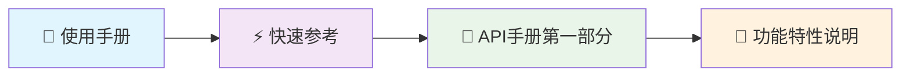
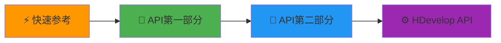

# 📚 HalconLable 文档中心 | Documentation Center

<div align="center">


### 🎯 基于 Qt + Halcon 的机器视觉控件完整文档集合

**专业 • 全面 • 易用 | Professional • Comprehensive • User-friendly**

</div>

---

<div style="border: 2px solid #ff4444; background-color: #ffe6e6; padding: 15px; border-radius: 8px; margin: 10px 0;">
<span style="color: #cc0000; font-weight: bold;">⚠️ 重要问题说明：</span><br>
<span style="color: #cc0000;">关于 Qt 信号槽机制中使用 HObject 类型导致的错误。这是因为当跨线程发送自定义类型的信号时，Qt 需要知道如何序列化和反序列化该类型，而 HObject 类型没有注册到 Qt 的元对象系统中</span>
</div>

### 🔧 解决方法 | Solution

<div style="border: 2px solid #4CAF50; background-color: #e8f5e9; padding: 15px; border-radius: 8px; margin: 10px 0;">

#### 方法一：注册 HObject 类型到 Qt 元对象系统

```cpp
// 在主程序或相关模块初始化时添加
#include <QMetaType>
#include "HalconCpp.h"

// 注册 HObject 类型
qRegisterMetaType<HObject>("HObject");

// 如果使用队列连接，还需要注册流操作符
QMetaType::registerStreamOperators<HObject>("HObject");
```

#### 方法二：使用智能指针传递

```cpp
// 使用智能指针避免直接传递 HObject
#include <QSharedPointer>

// 定义类型别名
typedef QSharedPointer<HObject> HObjectPtr;

// 注册智能指针类型
qRegisterMetaType<HObjectPtr>("HObjectPtr");

// 在信号槽中使用
signals:
    void imageProcessed(HObjectPtr image);

slots:
    void onImageProcessed(HObjectPtr image);
```

#### 方法三：转换为 Qt 支持的类型

```cpp
// 将 HObject 转换为 QImage 或其他 Qt 支持的类型
QImage convertHObjectToQImage(const HObject& hObject) {
    // 实现转换逻辑
    HTuple width, height, type;
    GetImageSize(hObject, &width, &height);
    GetImageType(hObject, &type);
    
    // 转换为 QImage
    // ... 具体实现
}

// 在信号槽中使用 QImage
signals:
    void imageReady(const QImage& image);
```

#### 方法四：使用事件系统替代信号槽

```cpp
// 定义自定义事件
class HObjectEvent : public QEvent {
public:
    static const QEvent::Type HObjectEventType = static_cast<QEvent::Type>(QEvent::User + 1);
    
    HObjectEvent(const HObject& obj) : QEvent(HObjectEventType), hObject(obj) {}
    
    HObject getHObject() const { return hObject; }
    
private:
    HObject hObject;
};

// 在接收端重写事件处理
bool MyWidget::event(QEvent* event) {
    if (event->type() == HObjectEvent::HObjectEventType) {
        HObjectEvent* hEvent = static_cast<HObjectEvent*>(event);
        processHObject(hEvent->getHObject());
        return true;
    }
    return QWidget::event(event);
}
```

</div>

### 💡 最佳实践建议 | Best Practice Recommendations

- ✅ **推荐使用方法一**：注册元类型，简单直接
- ✅ **对于复杂场景**：使用方法二，智能指针管理内存
- ✅ **跨平台考虑**：使用方法三，转换为标准Qt类型
- ⚠️ **注意线程安全**：确保HObject在多线程环境下的正确使用

---

## 📋 文档导航 | Document Navigation

### 🚀 快速开始 | Quick Start

| 文档 | 描述 | 适用人群 |
|------|------|---------|
| **[⚡ 快速参考卡片](HalconLable_Quick_Reference.md)** | 常用API速查，代码片段 | 有经验开发者 |
| **[📖 使用手册](HalconLable使用手册.md)** | 完整使用指南，示例教程 | 初学者，项目开发 |

### 📋 完整API参考 | Complete API Reference

| 文档 | 内容范围 | 详细程度 |
|------|---------|---------|
| **[📘 API手册 - 第一部分](HalconLable_API_Manual.md)** | 核心功能API，基础操作 | ⭐⭐⭐⭐⭐ |
| **[📗 API手册 - 第二部分](HalconLable_API_Manual_Part2.md)** | 高级功能API，3D检测，手眼标定 | ⭐⭐⭐⭐⭐ |

### 🏗️ 架构设计 | Architecture Design

| 文档 | 内容重点 | 技术深度 |
|------|---------|---------|
| **[🔄 架构图表集合](HalconLable_Architecture_Diagrams.md)** | 时序图，流程图，交互图 | ⭐⭐⭐⭐⭐ |

### 🔧 专业工具 | Specialized Tools

| 文档 | 功能领域 | 专业度 |
|------|---------|--------|
| **[🗂️ 文件管理指南](HalconFileManager_Guide.md)** | 文件操作，数据管理 | ⭐⭐⭐ |
| **[🔬 功能特性说明](README_HalconLable_Features.md)** | 详细功能列表，特性介绍 | ⭐⭐⭐⭐ |
| **[⚙️ HDevelop API手册](hdevelop_api_manual_cn.md)** | HDevelop集成，算法接口 | ⭐⭐⭐⭐⭐ |

---

## 🎯 文档使用指南 | Document Usage Guide

### 👶 初学者路径 | Beginner Path



**推荐顺序：**
1. **使用手册** - 了解基本概念和工作流程
2. **快速参考** - 熟悉常用API
3. **API手册第一部分** - 深入学习核心功能
4. **功能特性说明** - 探索高级特性

### 🚀 进阶开发者路径 | Advanced Developer Path



**推荐顺序：**
1. **快速参考** - 快速定位需要的API
2. **API手册第一部分** - 核心功能深入
3. **API手册第二部分** - 高级功能和3D检测
4. **HDevelop API手册** - 算法集成和优化

---

## 📊 文档特色 | Document Features

### 🌍 中英双语支持 | Bilingual Support

所有文档都提供中英双语版本，方便不同背景的开发者使用：

```cpp
// 中文注释 | English comments
void showImage(HObject inputImage);  // 显示图像 | Show image
```

### 📝 丰富的代码示例 | Rich Code Examples

每个API都提供完整的使用示例：

```cpp
// ✅ 完整示例 | Complete example
HalconLable *widget = new HalconLable(this);
HObject image = widget->QtReadImage("test.bmp");
widget->showImage(image);
```

### 🎯 最佳实践指导 | Best Practice Guidance

文档包含大量最佳实践和注意事项：

- ✅ **正确做法** | Correct approach
- ❌ **常见错误** | Common mistakes  
- 💡 **优化建议** | Optimization tips
- ⚠️ **注意事项** | Important notes

---

## 🔍 快速查找 | Quick Search

### 按功能查找 | Search by Function

| 功能类别 | 相关文档 | 关键章节 |
|---------|---------|---------|
| **相机操作** | 使用手册，API第一部分 | 相机操作章节 |
| **图像处理** | 使用手册，API第一部分 | 图像操作章节 |
| **形状检测** | 使用手册，API第一部分 | 形状检测章节 |
| **模板匹配** | 使用手册，API第一部分 | 模板匹配章节 |
| **二维码识别** | 使用手册，API第一部分 | 二维码识别章节 |
| **3D检测** | API第二部分 | 3D检测章节 |
| **手眼标定** | API第二部分 | 手眼标定章节 |
| **图像标注** | API第二部分 | 图像标注章节 |

### 按难度查找 | Search by Difficulty

| 难度级别 | 推荐文档 | 适合场景 |
|---------|---------|---------|
| 🟢 **入门级** | 使用手册前半部分 | 学习基础概念 |
| 🟡 **进阶级** | 使用手册后半部分，API第一部分 | 项目开发 |
| 🟠 **高级** | API第二部分，HDevelop API | 复杂算法集成 |
| 🔴 **专家级** | 完整文档集合 | 系统架构设计 |

---

## 📞 技术支持 | Technical Support

### 🆘 获取帮助 | Get Help

1. **查阅文档** - 首先查看相关文档章节
2. **搜索常见问题** - 查看使用手册的故障排除章节
3. **参考示例** - 运行完整的代码示例
4. **联系技术支持** - 提供详细的错误信息

### 🐛 报告问题 | Report Issues

当您发现文档问题时，请提供：

- 📄 **文档名称和章节**
- 🔍 **具体问题描述**
- 💻 **系统环境信息**
- 📋 **期望的改进建议**

---

## 🔄 文档更新 | Document Updates

### 📅 更新记录 | Update History

| 版本 | 日期 | 主要更新 |
|------|------|---------|
| **v2.1** | 2025-05-31 | 🛠️ 新增故障排除，最佳实践，完整API参考 |
| **v2.0** | 2025-05-28 | 🎯 重构文档结构，优化用户体验 |
| **v1.9** | 2025-05-25 | 📷 完善相机操作和形状检测文档 |

### 🔔 订阅更新 | Subscribe to Updates

- 关注项目仓库获取最新更新
- 定期检查文档版本号
- 查看更新日志了解新特性

---

## 🏆 文档质量保证 | Documentation Quality Assurance

### ✅ 质量标准 | Quality Standards

- **📝 内容准确性** - 所有API和示例均经过验证
- **🔍 代码可用性** - 示例代码可直接运行
- **🌍 双语一致性** - 中英文内容保持同步
- **📱 格式标准化** - 统一的文档格式和样式

### 🔄 持续改进 | Continuous Improvement

- **用户反馈驱动** - 根据用户需求优化文档
- **定期审查更新** - 确保内容时效性
- **示例代码测试** - 确保所有示例正常工作

---

<div align="center">

## 🎉 开始您的 HalconLable 开发之旅 | Start Your HalconLable Development Journey

**选择适合您的文档，开始高效的机器视觉开发！**  
**Choose the right documentation and start efficient machine vision development!**

### 🚀 推荐起始点 | Recommended Starting Points

| 您的角色 | 推荐文档 | 开始章节 |
|---------|---------|---------|
| **新手开发者** | [📖 使用手册](HalconLable使用手册.md) | 快速开始 |
| **有经验开发者** | [⚡ 快速参考](HalconLable_Quick_Reference.md) | 核心功能速查 |
| **系统架构师** | [📘 API手册](HalconLable_API_Manual.md) | 完整API参考 |
| **算法工程师** | [⚙️ HDevelop API](hdevelop_api_manual_cn.md) | 算法集成 |

---

**📧 如有疑问或建议，欢迎联系技术支持团队**  
**For questions or suggestions, please contact our technical support team**

**文档版本：v2.1** | **更新日期：2025-05-31** | **维护团队：开发团队**

</div> 